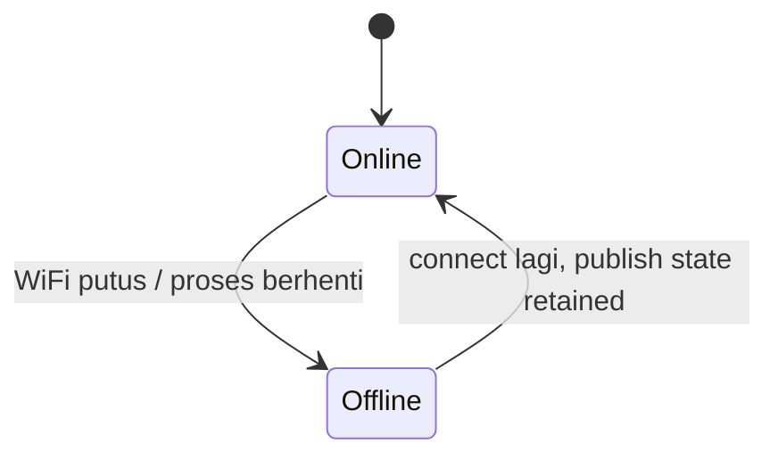

# iot-rain-domain

Domain knowledge untuk proyek sensor hujan jemuran **HujanPantau** (ESP32 + React + Vercel, tanpa backend).

## Dokumen sumber kebenaran

Baca dulu sebelum mengubah kode terkait:

- `API.md` **Bagian A** — kontrak MQTT, topik, payload, LWT, aturan offline. Ini yang mengikat firmware dan web.
- `ERD.md` — bentuk entitas, batas nilai payload, alasan di balik keputusan.
- `PRD.md` bagian 3.2 dan 14 — non-tujuan dan batasan yang tidak boleh dilanggar.

Referensi di folder ini:

- `references/mqtt-contract.md` — tabel field lengkap, batas nilai, contoh payload.
- `references/hardware-wiring.md` — pinout ESP32, kalibrasi sensor, tipe sensor.

## Aturan yang tidak boleh dilanggar

### 1. Jangan kirim command dari web (v1)

Aplikasi **read-only**. Web hanya `subscribe`, tidak pernah `publish` ke topik mana pun. Topik `hujansensor/{id}/cmd` disiapkan untuk v2 tapi masih diblokir.

Jangan menambahkan tombol kontrol, restart, atau pengaturan ambang dari web tanpa membahas dulu dampak ke `PRD.md` non-tujuan.

### 2. Jangan ubah bentuk payload sembarangan

Setiap perubahan field wajib mempertimbangkan versi `v`. Lihat `API.md` bagian D. Field `env` dan `power` harus tetap boleh `null` agar perangkat tanpa DHT22 atau pengukur tegangan tetap kompatibel.

### 3. Selalu pasang LWT

Tanpa LWT, web tidak akan pernah mendeteksi perangkat yang mati. Ambang deteksi offline di web adalah 90 detik, sedangkan interval `state` adalah 5 detik.

### 4. Deteksi hujan wajib pakai histeresis

Perbandingan langsung terhadap satu ambang menghasilkan status yang berkedip-kedip dan memicu notifikasi Telegram berulang. Lihat bagian di bawah.

## Algoritma deteksi hujan

Sensor hujan analog umumnya **terbalik**: nilai tinggi saat kering, nilai rendah saat basah. Konversi dulu ke persentase agar ambang masuk akal:

```cpp
// nilai tinggi = kering pada kebanyakan sensor optik/kapasitif
int pct = map(raw, RAW_KERING, RAW_BASAH, 0, 100);
pct = constrain(pct, 0, 100);
```

Kemudian terapkan **EMA (exponential moving average)** untuk meredam noise, lalu **histeresis** agar tidak bolak-balik:

```cpp
const float ALPHA    = 0.15f;   // smoothing, makin kecil makin halus
const int   AMBANG   = 60;      // mulai dianggap hujan
const int   LEPAS    = AMBANG - 15;  // baru dianggap berhenti

ema = ema + ALPHA * (pct - ema);

bool sekarangHujan;
if (!hujanAktif) sekarangHujan = (ema >= AMBANG);
else             sekarangHujan = (ema >= LEPAS);
```

Dua ambang terpisah itulah histeresis. Jarak 15 poin mencegah fluktuasi di sekitar batas memicu transisi berulang.

Setiap transisi menghasilkan event:

| Transisi | Event | Aksi |
|---|---|---|
| kering ke hujan | `rain_start` | kirim Telegram (cek cooldown 10 menit) |
| hujan ke kering | `rain_stop` | kirim Telegram hanya bila durasi >= 5 menit |

**Durasi minimal sebelum notifikasi: 60 detik.** Ini mencegah notifikasi untuk gerimis sesaat (lihat `PRD.md` Q2).

## Status online/offline



- `state` dipublish **retained** setiap 5 detik dan saat boot.
- LWT dikirim broker otomatis saat koneksi putus tanpa disconnect bersih.
- Web menganggap offline bila `status == "offline"` ATAU `lastSeen` lebih dari 90 detik lalu.

Jangan mengandalkan satu saja dari keduanya.

## Notifikasi Telegram

- Dikirim **dari ESP32**, bukan dari web. Token bot hanya ada di LittleFS.
- Escape karakter HTML (`&`, `<`, `>`) karena `parse_mode` adalah `HTML`.
- Hormati cooldown: 10 menit untuk `rain_start`, 30 menit untuk `rain_stop` dan pemulihan online.
- Jangan blokir loop utama. Gunakan tugas terpisah atau timeout 5 detik.
- Bila gagal dengan status `401` (token salah), hentikan percobaan, jangan ulangi terus-menerus.

## Broker

| Sisi | Protokol | Port |
|---|---|---|
| ESP32 | MQTT over TCP | 1883 (plaintext) |
| Browser | MQTT over WSS | 8884 |

Keduanya memakai broker yang sama. Browser tidak bisa memakai 1883.

Cadangan: `broker.emqx.io`, `broker.hivemq.com`, `test.mosquitto.org`.

Karena broker publik menerima koneksi anonim, `deviceId` (`hs-` + 12 hex) berfungsi sebagai pengaman informal, **bukan keamanan sesungguhnya**. Lihat `PRD.md` bagian 13.3.

## Konvensi kode firmware

- PlatformIO, papan `esp32dev`.
- Library: `PubSubClient`, `ArduinoJson`, `WiFiManager`, `ArduinoJson`.
- Konfigurasi (SSID, token, chat ID, ambang) disimpan di **LittleFS**, bukan hardcode di `.ino`.
- Validasi payload dengan batas nilai di `references/mqtt-contract.md`. Nilai di luar batas harus ditolak, jangan dipangkas diam-diam.
- Log ke Serial pada level `DEBUG`, jangan `Serial.println` di produksi tanpa penanda level.

## Checklist sebelum selesai

- [ ] `v` pada payload ikut naik bila skema berubah
- [ ] `env` dan `power` tetap boleh null
- [ ] LWT masih terpasang dengan benar
- [ ] Histeresis dan cooldown tidak terhapus saat refactor
- [ ] Web tetap read-only (tidak ada `publish`)
- [ ] `API.md` dan `ERD.md` diperbarui bila kontrak berubah
