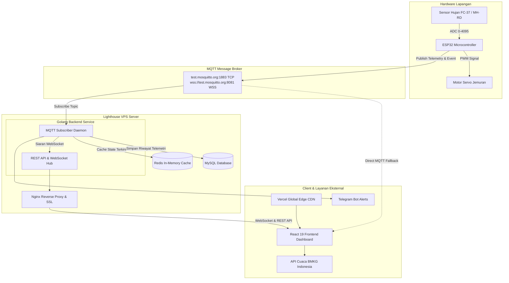
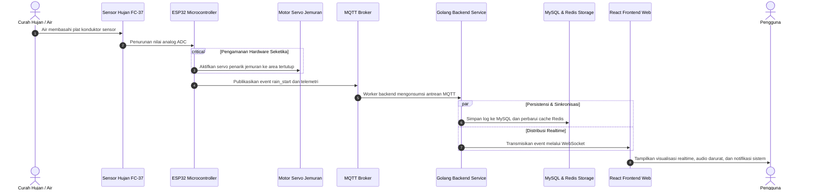

# HujanPantau - Sistem Pemantauan Sensor Hujan dan Jemuran Otomatis IoT

[](https://react.dev/)
[](https://www.typescriptlang.org/)
[](https://vitejs.dev/)
[](https://tailwindcss.com/)
[](https://go.dev/)
[](https://www.mysql.com/)
[](https://redis.io/)
[](https://mosquitto.org/)
[](https://vercel.com/)

HujanPantau adalah platform Internet of Things (IoT) cerdas end-to-end yang dirancang untuk mendeteksi intensitas air hujan secara realtime, menggerakkan motor servo penarik jemuran otomatis, mencatat riwayat telemetri ke database relasional dan in-memory cache, serta menyajikan visualisasi data modern yang terintegrasi langsung dengan prakiraan cuaca resmi BMKG Indonesia.

---

## Daftar Lingkungan (Environments)

### 1. Web Frontend (Vercel)
* **Production**: [https://rintik-self.vercel.app/](https://rintik-self.vercel.app/) (Branch: `main`)
* **Staging / Preview**: Vercel Preview Deployments (Dikelola otomatis pada setiap push ke branch `staging`)

### 2. Backend Server & API Gateway
Untuk menjaga integritas server dan mencegah potensi eksploitasi endpoint secara publik, konfigurasi internal host, IP server, port service, serta detail endpoint backend didokumentasikan secara terpisah pada panduan teknis internal:
* Dokumentasi Infrastruktur & Endpoint: [docs/DEPLOYMENT_GUIDE.md](docs/DEPLOYMENT_GUIDE.md)

---

## Arsitektur Sistem

Sistem mengadopsi pola arsitektur modular terdistribusi (Decoupled Microservice Architecture) untuk menjamin keandalan perangkat keras dan ketersediaan layanan web:



---

## Diagram Sekuensial Operasional



---

## Fitur Utama

* **Deteksi Presisi & Proteksi Hardware**: Menggunakan kalibrasi nilai analog ADC dengan logika histeresis untuk mengeliminasi false positive akibat kelembapan tinggi atau tetesan embun pagi.
* **Otonomi Perangkat Keras**: Logika penarikan jemuran dieksekusi langsung di mikrokontroler tanpa bergantung pada ketersediaan koneksi internet demi keselamatan fisik jemuran.
* **Backend Kinerja Tinggi**: Dibangun menggunakan bahasa Go dengan arsitektur non-blocking, konsumsi memori hemat (~15 MB RAM), dan penanganan request berkecepatan tinggi.
* **Penyimpanan Terdistribusi**: Menggabungkan MySQL 5.7 untuk integritas data jangka panjang dan Redis untuk akselerasi akses status perangkat secara in-memory.
* **Antarmuka Responsif & PWA**: Dibangun menggunakan React 19, TypeScript, dan Tailwind CSS dengan dukungan tema Gelap/Terang, visualisasi grafik interaktif, dan kapabilitas Progressive Web App (PWA).
* **Integrasi Data Meteorologi**: Sinkronisasi data cuaca berkala dengan Open Data BMKG Indonesia berdasarkan kode wilayah administratif tingkat kelurahan (ADM4).
* **Alur CI/CD Otomatis**: Integrasi otomatis melalui GitHub Actions untuk kompilasi binary Linux, verifikasi tipe TypeScript, serta deployment berkala ke server staging dan produksi.

---

## Struktur Direktori Repositori

```
Iot Sensor Hujan/
├── .github/
│   └── workflows/
│       └── deploy.yml            # Pipeline CI/CD GitHub Actions
├── backend/                      # Layanan Backend Golang
│   ├── database/                 # Driver MySQL (GORM) dan Redis cache
│   ├── deploy/                   # Service unit systemd dan konfigurasi Nginx
│   ├── handlers/                 # Handler REST API dan WebSocket hub
│   ├── models/                   # Definisi struktur entitas data
│   ├── mqtt/                     # Background worker subscriber MQTT
│   ├── hujan-backend-linux       # Binary executable Linux AMD64
│   ├── go.mod
│   └── main.go
├── frontend/                     # Dashboard SPA React
│   ├── src/                      # Source code aplikasi, hooks, dan state manager
│   ├── public/                   # Asset statis, ikon, dan manifest PWA
│   ├── vercel.json               # Konfigurasi routing SPA dan HTTP security headers
│   └── package.json
└── docs/
    └── DEPLOYMENT_GUIDE.md       # Panduan lengkap deployment infrastruktur server
```

---

## Panduan Instalasi Lokal

### Prasyarat
* Node.js versi 20 atau lebih baru
* Go versi 1.22 atau lebih baru
* Git

### 1. Menjalankan Frontend
```bash
cd frontend
npm install
npm run dev
```
Akses aplikasi melalui browser pada alamat: `http://localhost:5173`

### 2. Menjalankan Backend
```bash
cd backend
go run main.go
```
Layanan backend akan aktif pada port `:8080`.

---

## Dokumentasi Teknis & Manajemen Task

Untuk menjaga alur pengembangan tetap terstruktur dan mempermudah kolaborasi antara Backend Engineer dan Frontend UI/AI:
* **Task Khusus Backend (Golang, Database & AI Engine)**: [docs/BACKEND_TASKS.md](docs/BACKEND_TASKS.md)
* **Task Khusus Frontend (React, UI/UX & Komponen AI)**: [docs/FRONTEND_TASKS.md](docs/FRONTEND_TASKS.md)
* **Spesifikasi REST API & WebSocket Hub**: [docs/API.md](docs/API.md)
* **Struktur Data & Relasi Database (ERD)**: [docs/ERD.md](docs/ERD.md)
* **Panduan Deployment Server & VPS aaPanel**: [docs/DEPLOYMENT_GUIDE.md](docs/DEPLOYMENT_GUIDE.md)

---

## Lisensi

Proyek ini didistribusikan di bawah lisensi [MIT License](LICENSE).
