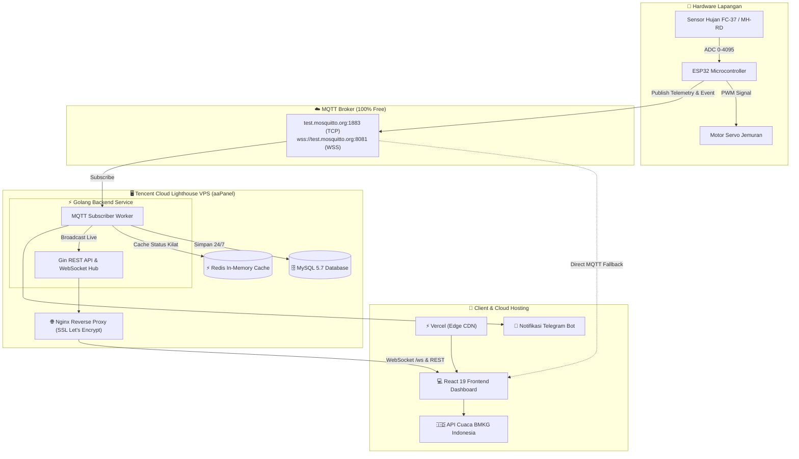
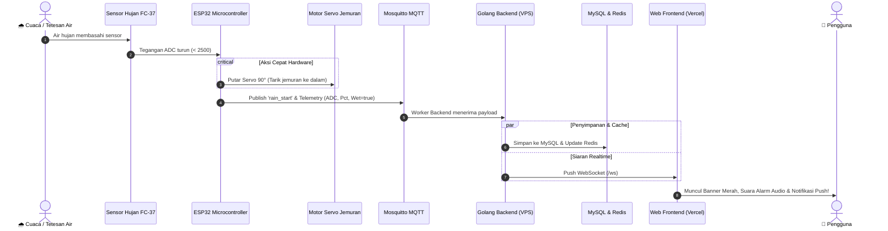

# 🌧️ HujanPantau — Sistem IoT Sensor Hujan & Jemuran Otomatis

[](https://react.dev/)
[](https://www.typescriptlang.org/)
[](https://vitejs.dev/)
[](https://tailwindcss.com/)
[](https://go.dev/)
[](https://www.mysql.com/)
[](https://redis.io/)
[](https://mosquitto.org/)
[](https://vercel.com/)

**HujanPantau** adalah platform *Internet of Things* (IoT) cerdas *end-to-end* untuk mendeteksi hujan secara *realtime*, mengendalikan motor servo penarik jemuran otomatis, mencatat histori cuaca 24/7 ke database MySQL & Redis, dan menampilkan pemantauan interaktif dengan prakiraan cuaca resmi BMKG Indonesia.

---

## 🏛️ Arsitektur Sistem

Sistem ini dirancang dengan arsitektur terpisah (*Decoupled Microservice Architecture*):



---

## 🔄 Alur Deteksi Hujan & Tarik Jemuran Otomatis



---

## ✨ Fitur Utama

- **🌧️ Deteksi Hujan Real-time & Presisi**: Menggunakan sensor FC-37/MH-RD dengan kalibrasi ADC dan proteksi histeresis anti-flicker (*false alarms*).
- **👔 Tarik Jemuran Otomatis**: Motor servo langsung bergerak otomatis di sisi perangkat tanpa ketergantungan internet untuk keselamatan jemuran.
- **⚡ Backend Golang Super Ringan**: Single static binary dengan konsumsi RAM hanya **~15 MB** dan CPU **< 0.5%**, sangat hemat untuk VPS ekonomis.
- **🗄️ Dual Storage (MySQL & Redis)**: Data telemetri dan riwayat hujan tersimpan permanen di **MySQL 5.7**, sementara status terkini di-cache dengan kecepatan mikrodetik di **Redis**.
- **🌐 Frontend Modern di Vercel**: Dibangun dengan **React 19**, **TypeScript**, dan **Tailwind CSS v4**, mendukung Dark/Light Mode, grafik tren interaktif, dan PWA.
- **⛅ Integrasi Cuaca BMKG**: Menampilkan prakiraan cuaca resmi BMKG Indonesia per kecamatan secara *real-time*.
- **🔔 Multi-Channel Alert**: Notifikasi audio darurat, browser Web Push Notification, dan integrasi Bot Telegram.
- **📡 100% Bebas Biaya Langganan**: Menggunakan public broker Eclipse Mosquitto dan hosting Vercel gratis tanpa perlu kartu kredit.

---

## 📁 Struktur Repositori

```
Iot Sensor Hujan/
├── .github/
│   └── workflows/
│       └── deploy.yml            # CI/CD GitHub Actions: validasi & build otomatis
├── backend/                      # Backend Golang
│   ├── database/                 # GORM MySQL & Redis in-memory cache
│   ├── deploy/                   # Systemd service unit & konfigurasi Nginx aaPanel
│   ├── handlers/                 # REST API endpoints & WebSocket Hub
│   ├── models/                   # Struct data (Device, Telemetry, Event)
│   ├── mqtt/                     # Background MQTT subscriber daemon
│   ├── hujan-backend-linux       # Binary Linux siap deploy (~21 MB)
│   ├── go.mod
│   └── main.go
├── frontend/                     # Frontend SPA React
│   ├── src/                      # Komponen React, hooks, dan state manager
│   ├── public/                   # Asset statis, ikon PWA, manifest
│   ├── vercel.json               # Konfigurasi routing SPA & security headers
│   └── package.json
└── docs/
    └── DEPLOYMENT_GUIDE.md       # Panduan instalasi dan deployment lengkap
```

---

## 🚀 Panduan Cepat Menjalankan Lokal

### 1. Jalankan Frontend
```bash
cd frontend
npm install
npm run dev
```
Akses dashboard di browser: `http://localhost:5173`

### 2. Jalankan Backend (Golang)
```bash
cd backend
go run main.go
```
Backend akan aktif di port `:8080`.

---

## 📖 Panduan Deployment Server

Panduan lengkap mengenai cara deploy ke **Vercel** dan VPS **Tencent Cloud Lighthouse (aaPanel)** dengan domain gratis `sslip.io` serta SSL Let's Encrypt tersedia di:
👉 **[docs/DEPLOYMENT_GUIDE.md](docs/DEPLOYMENT_GUIDE.md)**

---

## 📄 Lisensi

Proyek ini dilisensikan di bawah [MIT License](LICENSE).
