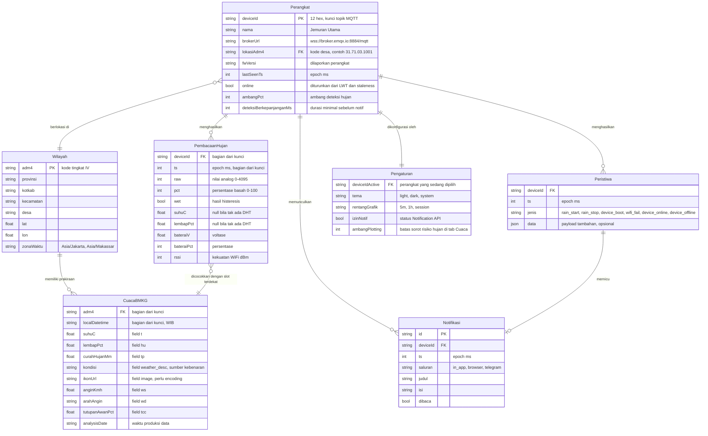
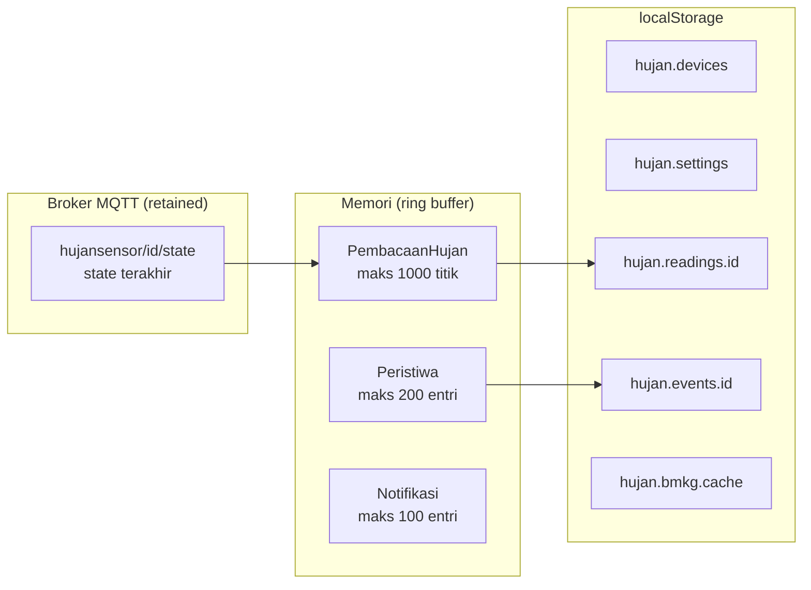
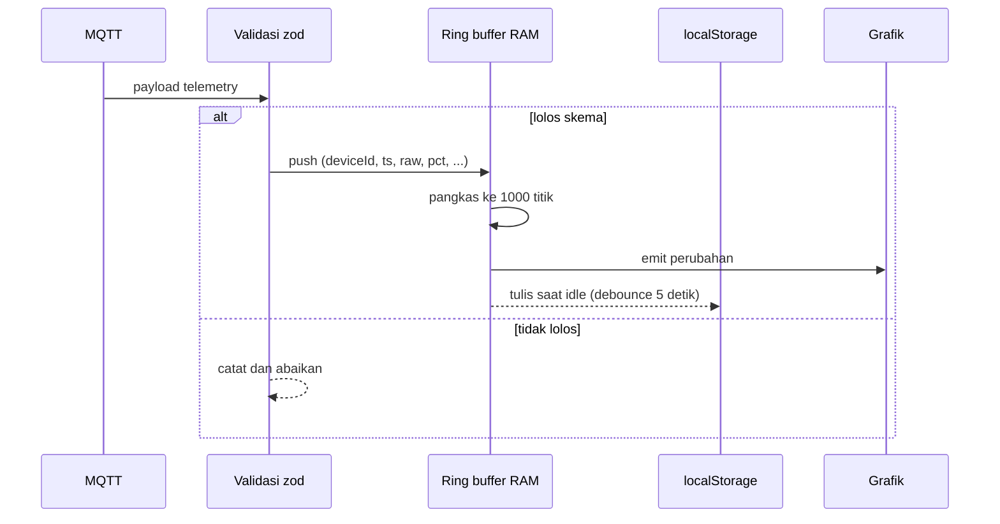
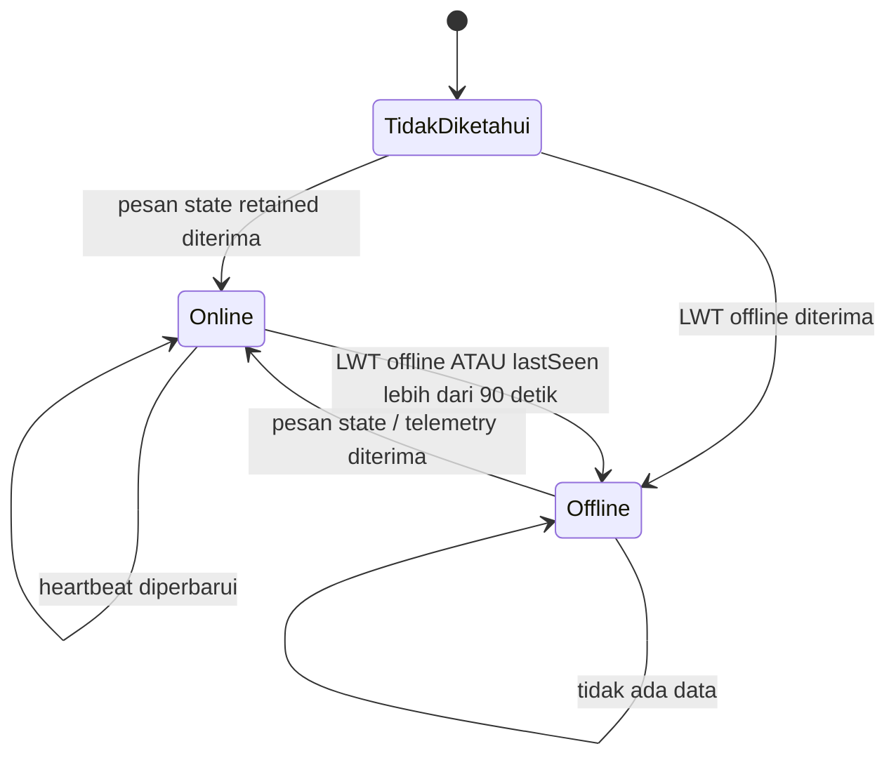
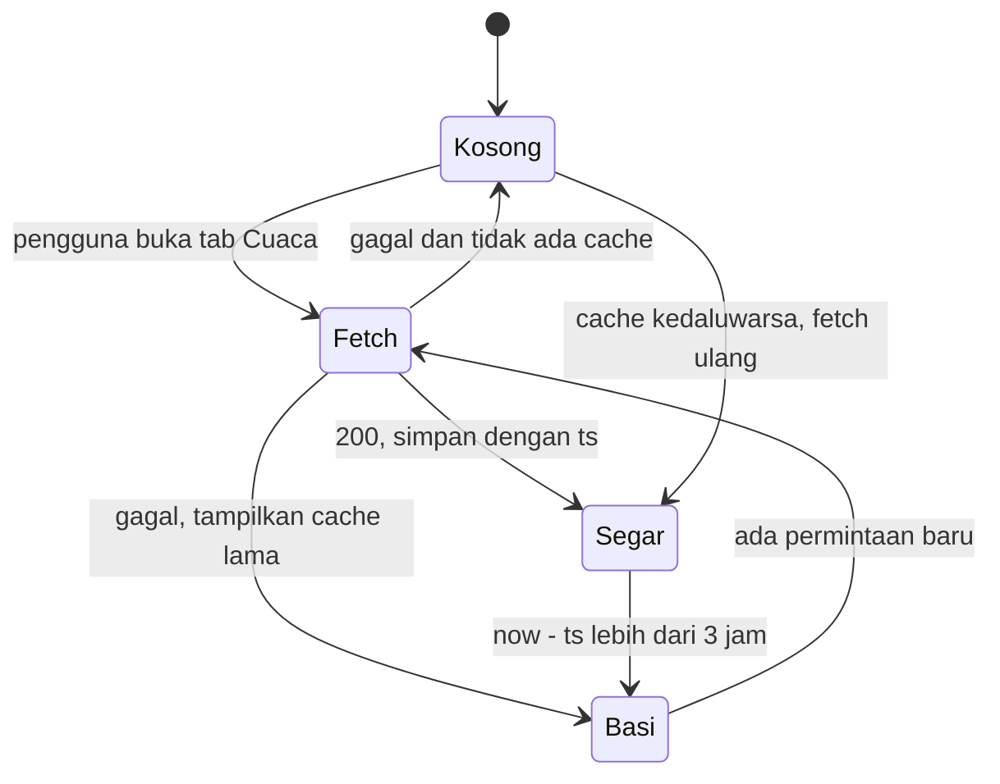

# ERD - Model Data Konseptual

Dokumen ini mendeskripsikan model data **HujanPantau** (lihat `PRD.md`). Karena aplikasi berjalan tanpa backend, tidak ada database server. Model di bawah adalah **model data konseptual** yang diimplementasikan lewat tiga media: memori browser, `localStorage`, dan pesan retained di broker MQTT.

| | |
|---|---|
| Versi | 1.0 |
| Tanggal | 2026-10-08 |
| Terkait | `PRD.md` - `API.md` |

---

## 1. Diagram ERD

---

## 2. Kunci dan Unik

Entitas di bawah tidak punya auto-increment. Kunci diturunkan dari sumber datanya.

| Entitas | Kunci utama | Alasan |
|---|---|---|
| `Perangkat` | `deviceId` | Juga menjadi segmen topik MQTT |
| `PembacaanHujan` | `(deviceId, ts)` | Satu perangkat bisa punya banyak pembacaan pada waktu sama jika payload duplikat |
| `CuacaBMKG` | `(adm4, localDatetime)` | Satu lokasi, satu slot waktu |
| `Wilayah` | `adm4` | Satu kode = satu desa |
| `Peristiwa` | `(deviceId, ts, jenis)` | Bisa ada dua event berbeda pada milidetik sama |
| `Notifikasi` | `id` | UUID acak di sisi klien |
| `Pengaturan` | `deviceIdActive` | Satu baris per perangkat aktif |

---

## 3. Sifat dan Karakter Kolom

Kolom bertanda **null** boleh kosong. Nilai `0` berarti "dilaporkan sebagai nol", bukan "tidak ada data". Pembedaan ini penting karena PRD meminta FR-12.

| Kolom | Tipe | Null | Catatan |
|---|---|---|---|
| `PembacaanHujan.raw` | int 0-4095 | tidak | Nilai ADC |
| `PembacaanHujan.pct` | int 0-100 | tidak | Setelah konversi dan normalisasi |
| `PembacaanHujan.wet` | bool | tidak | Hasil histeresis, bukan raw |
| `PembacaanHujan.suhuC` | float | **ya** | Null jika perangkat tidak melaporkan |
| `PembacaanHujan.lembapPct` | float | **ya** | Null jika perangkat tidak melaporkan |
| `PembacaanHujan.bateraiV` | float | **ya** | Null jika tidak ada divider tegangan |
| `PembacaanHujan.rssi` | int | **ya** | Negatif, misalnya -58 |
| `CuacaBMKG.curahHujanMm` | float | **ya** | Kadang null di response |
| `CuacaBMKG.ikonUrl` | string | **ya** | Bisa null |
| `CuacaBMKG.localDatetime` | string | tidak | Pakai field ini, jangan konversi UTC |
| `Wilayah.zonaWaktu` | string | **ya** | Berbeda per wilayah |

### 3.1 Aturan turunan (bukan kolom tersimpan)

Semua nilai berikut dihitung saat dirender, bukan disimpan:

| Nilai | Rumus |
|---|---|
| `status` | `offline` jika LWT `offline` atau `lastSeen > 90 detik` lalu; selain itu `hujan` jika `wet`, selain itu `kering` |
| `risikoSlot` | `true` jika `curahHujanMm > 0` atau `kondisi` mengandung kata hujan |
| `jamBerpotensiHujan` | jumlah slot dengan `risikoSlot` dikali 3 |
| `selisihVsBmkg` | `wet` sensor dikurangi `risikoSlot` BMKG pada slot terdekat |
| `menitHujanHariIni` | jumlah detik `wet == true` hari ini dibagi 60 |
| `kadarStale` | `now - localDatetimeFetch` dibagi TTL |

---

## 4. Pemetaan ke Media Penyimpanan

### 4.1 Daftar kunci localStorage

| Kunci | Bentuk | Batas | TTL |
|---|---|---|---|
| `hujan.devices` | array `Perangkat` | 5 entri | tidak ada |
| `hujan.settings` | objek `Pengaturan` | 1 entri | tidak ada |
| `hujan.readings.{deviceId}` | array `PembacaanHujan` | 1000 titik | tidak ada, dipangkas saat tertulis |
| `hujan.events.{deviceId}` | array `Peristiwa` | 200 entri | tidak ada, dipangkas saat tertulis |
| `hujan.notifications.{deviceId}` | array `Notifikasi` | 100 entri | tidak ada |
| `hujan.bmkg.cache.{adm4}` | `{ ts, data: array CuacaBMKG }` | 1 entri per lokasi | 3 jam |

### 4.2 Aturan pengelolaan penyimpanan

1. **Selalu tulis atomik.** Baca, modifikasi array, lalu tulis ulang seluruh nilai. `localStorage` tidak mendukung transaksi.
2. **Batasi sebelum menulis.** Potong array ke batas terpanjang lebih dulu agar tidak melebihi kuota 5 MB per origin.
3. **Tangani `QuotaExceededError`.** Jika penuh, pangkas separuh pembacaan lama, ulangi sekali, lalu berhenti mencoba dan catat kejadian.
4. **Validasi saat membaca.** `JSON.parse` bisa gagal karena pengguna menghapus sebagian storage. Baca defensif, dan jika gagal kembalikan array kosong, jangan sampai aplikasi crash.
5. **Cache BMKG punya stempel waktu sendiri.** Simpan `ts` fetch, bandingkan dengan `Date.now()`, bukan dengan data prakiraan.

### 4.3 Alasan memilih localStorage

| Alternatif | Alasan tidak dipakai |
|---|---|
| IndexedDB | Butuh async API dan lebih banyak kode, padahal volume data kecil (sekitar 100 KB) |
| Cookie | Terkirim ke server tiap request, boros, dan tidak ada gunanya di aplikasi tanpa backend |
| `sessionStorage` | Hilang saat tab ditutup, sementara PRD menuntut data bertahan setelah refresh |
| Cache Storage API | Cocok untuk aset, bukan data berubah-ubah |

---

## 5. Aliran dan Siklus Hidup Data

### 5.1 Satu titik pembacaan

Debounce penulisan ke `localStorage` disengaja. Menulis 1.000 titik tiap 3 detik akan memperlambat UI dan memperpendek umur storage.

### 5.2 Perubahan status perangkat

Penghentian status `Offline` ke `Online` tidak membutuhkan LWT karena LWT hanya dikirim saat koneksi putus. Cukup adanya pesan baru.

### 5.3 Siklus prakiraan BMKG

---

## 6. Sumber Data per Entitas

| Entitas | Sumber | Titik masuk kode |
|---|---|---|
| `Perangkat` | diisi pengguna, `fwVersi` dari MQTT | `src/store/devices.ts` |
| `PembacaanHujan` | topik `hujansensor/{id}/telemetry` | `src/store/telemetry.ts` |
| `CuacaBMKG` | `GET api.bmkg.go.id/publik/prakiraan-cuaca` | `src/lib/bmkg.ts` |
| `Wilayah` | field `lokasi` pada response BMKG | `src/lib/bmkg.ts` |
| `Peristiwa` | topik `hujansensor/{id}/event` | `src/store/events.ts` |
| `Notifikasi` | diturunkan dari peristiwa dan status | `src/lib/notify.ts` |
| `Pengaturan` | interaksi pengguna | `src/store/settings.ts` |

> Nama file adalah rancangan untuk milestone M1 sampai M4 di `PRD.md`, belum ada di repositori saat dokumen ini ditulis.

---

## 7. Keputusan Desain yang Tidak Jelas

| # | Keputusan | Alternatif | Alasan dipilih |
|---|---|---|---|
| D1 | `PembacaanHujan` bukan baris relasional tetapi array ring buffer | Simpan semua ke storage | Storage browser terbatas dan menulis 1.000 objek tiap 3 detik sangat mahal |
| D2 | `CuacaBMKG` disimpan sebagai array datar, bukan per hari | Struktur `{ hari: [slot] }` | Lebih mudah difilter dan digambar pada satu sumbu waktu |
| D3 | `status` tidak disimpan | Simpan sebagai kolom | Turunan dari dua sumber (LWT dan staleness), harus dihitung ulang tiap detik agar tidak basi |
| D4 | `selisihVsBmkg` dihitung saat render | Simpan sebagai kolom | Bergantung pada waktu, nilainya berubah sendiri tanpa data baru |
| D5 | Satu `Pengaturan` per perangkat aktif, bukan per perangkat | Pengaturan global | Perangkat berbeda bisa punya ambang berbeda |
| D6 | Batas 1.000 titik pembacaan | Tidak dibatasi | Menjaga grafik tetap di 50 fps sesuai NFR-02 |

---

## 8. Kontrak Payload yang Divalidasi

Setiap payload masuk diverifikasi sebelum menyentuh entitas mana pun. Detail field ada di `API.md`. Ringkasan cakupan validasi:

| Payload | Divalidasi oleh | Jika gagal |
|---|---|---|
| `state` | skema `StatePayload` | diabaikan, state lama tetap berlaku |
| `telemetry` | skema `TelemetryPayload` | diabaikan, grafik tidak menerima titik |
| `event` | skema `EventPayload` | diabaikan, tidak masuk log |
| Response BMKG | skema `BmkgResponse` | tampilkan cache lama atau layar kosong |
| URL broker | format `wss://` atau `ws://` dengan port valid | tombol simpan dinonaktifkan |
| `deviceId` | cocok dengan pola `hs-[0-9a-f]{12}` | tombol simpan dinonaktifkan |

Aturan batas nilai agar payload nakal tidak merusak tampilan:

| Field | Batas |
|---|---|
| `raw` | 0 sampai 4095 |
| `pct`, `bateraiPct`, `lembapPct` | 0 sampai 100 |
| `suhuC` | -50 sampai 80 |
| `bateraiV` | 0 sampai 5 |
| `rssi` | -120 sampai 0 |
| `uptimeS` | 0 sampai 31.536.000 (1 tahun) |

Nilai di luar batas membuat payload dianggap tidak valid, bukan dipangkas diam-diam. Pemangkatan diam-diam menyembunyikan bug firmware.
