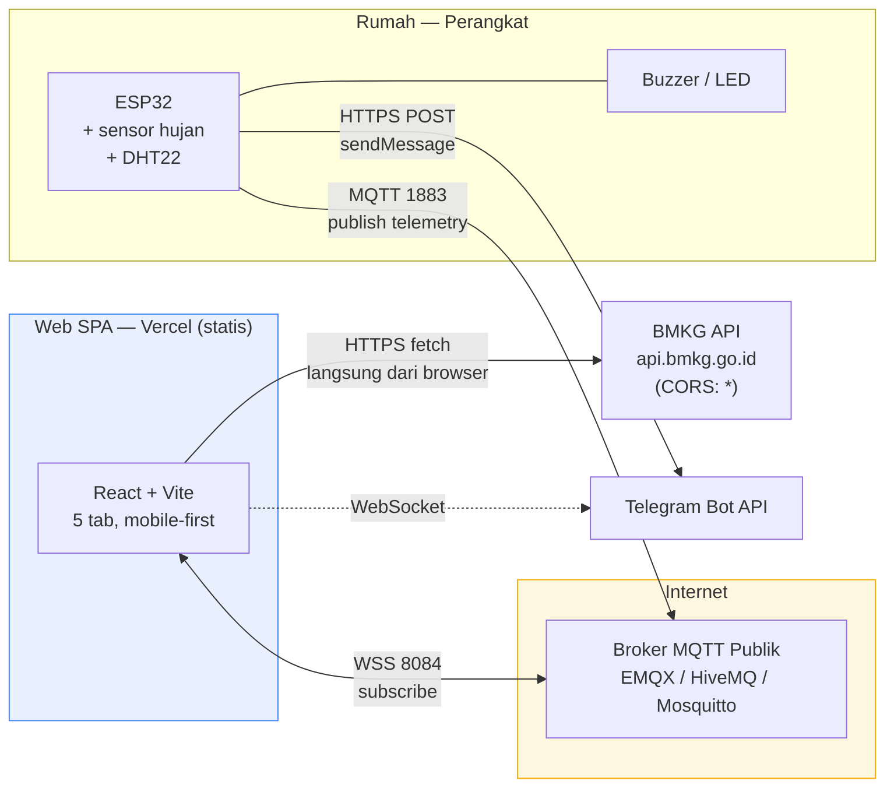
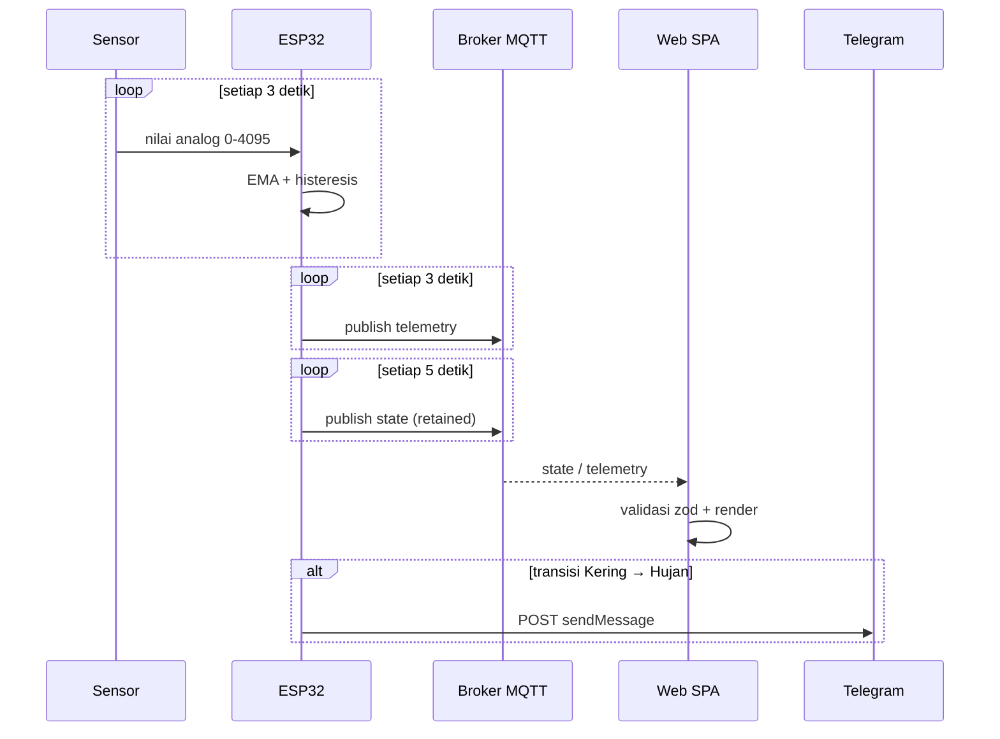
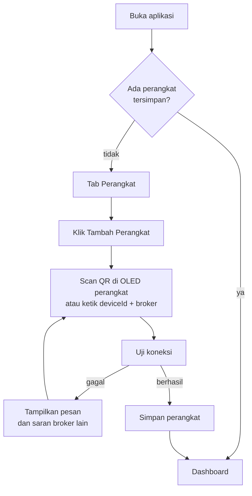
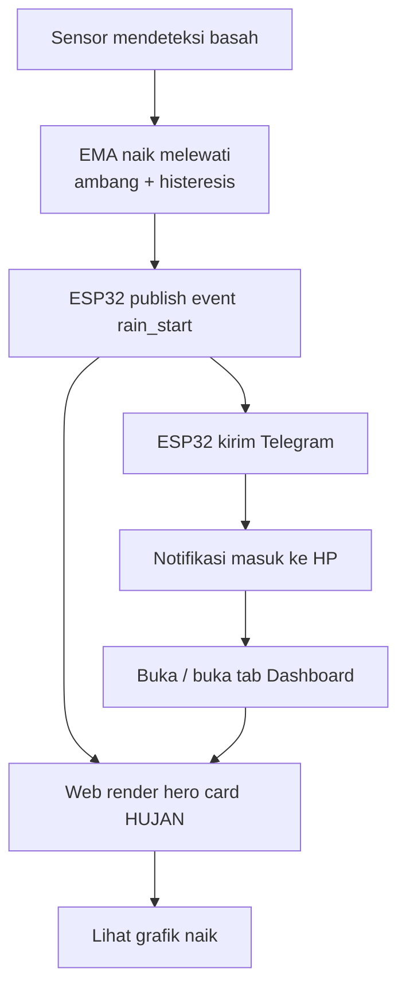
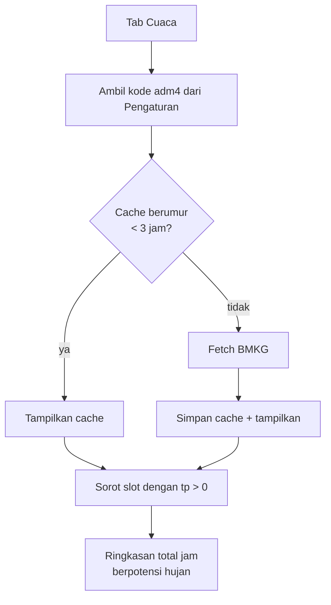

# PRD — Dashboard IoT Sensor Hujan Jemuran

| | |
|---|---|
| **Nama produk** | HujanPantau |
| **Versi dokumen** | 1.0 |
| **Status** | Draft untuk implementasi |
| **Tanggal** | 2026-10-08 |
| **Dokumen terkait** | [`ERD.md`](./ERD.md) · [`API.md`](./API.md) |

---

## 1. Ringkasan Eksekutif

**HujanPantau** adalah dashboard web mobile-first untuk memantau sensor pendeteksi hujan yang dipasang di atas jemuran, dengan fungsi utama memberi tahu pengguna *saat jemuran harus segera diambil*.

Produk ini terdiri dari tiga bagian yang saling terhubung:

1. **Firmware ESP32** — membaca sensor hujan analog, menentukan status basah/kering, lalu mempublikasikan telemetry secara realtime ke broker MQTT publik.
2. **Web SPA (React + Vite, di-host di Vercel)** — berlangganan data perangkat secara realtime lewat MQTT-over-WebSocket, menampilkan status, grafik, dan riwayat, serta mengambil prakiraan cuaca resmi dari BMKG.
3. **Notifikasi Telegram** — dikirim langsung oleh ESP32 ke Telegram Bot API, sehingga pengguna tetap diberi tahu walau aplikasi web sedang tidak dibuka.

Seluruh sistem berjalan **tanpa backend** — tidak ada server, tidak ada database, tidak ada API key di sisi frontend. Data realtime mengalir dua arah melalui protokol MQTT, dan data cuaca diakses langsung dari API BMKG yang mengizinkan CORS.

---

## 2. Masalah & Latar Belakang

### 2.1 Situasi yang dialami pengguna

- Cuaca di Indonesia berubah cepat. Hujan turun suddenly sering terjadi di siang hari ketika orang sedang bekerja atau beristirahat di dalam rumah.
- Jemuran yang terlupa bisa membusuk, berbau, dan.require penanganan ulang — kerugian waktu dan listrik.
- Orang sudah memasang aplikasi cuaca umum, tetapi **tidak ada yang tahu kondisi jemuran di tempatnya sendiri**. Aplikasi cuaca umum hanya memberi probabilitas wilayah yang luas, bukan kondisi nyata di halaman rumah.

### 2.2 Kesenjangan solusi yang ada

| Solusi yang ada | Kekurangan |
|---|---|
| Cek aplikasi cuaca umum | Terlalu umum (kecamatan), tidak mewakili kondisi riil jemuran |
| Timer manual / alarmingat-ingat | Mudah lupa, tidak ada data |
| ESP32 + buzzer hanya | Tidak ada rekaman, tidak bisa dicek dari mana saja |
| Kamera CCTV di halaman | Mahal, boros listrik, tidak memberi notifikasi |

### 2.3 Kesimpulan

Dibutuhkan solusi yang **ringan, murah, dan bisa dipantau dari HP** — cukup satu sensor murah + satu ESP32 + satu halaman web. That's the gap this product fills.

---

## 3. Tujuan & Non-Tujuan

### 3.1 Tujuan

| ID | Tujuan | Ukuran berhasil |
|---|---|---|
| O1 | Pengguna tahu status jemuran tanpa harus ke halaman | < 3 detik sejak_sensor berubah_ |
| O2 | Pengguna diberi tahu saat hujan turun | notifikasi Telegram terkirim < 30 detik setelah sensor mendeteksi |
| O3 | Pengguna punya bukti historis | grafik + log event bertahan setelah halaman di-refresh |
| O4 | Biaya operasional nol | Rp 0 / bulan (free tier Vercel + broker publik) |
| O5 | Nyaman dipakai sambil rebahan | tampil penuh di layar HP 360 px, tanpa scroll horizontal |

### 3.2 Non-Tujuan (v1 — sengaja tidak dikerjakan)

Segera ini **tidak** masuk lingkup versi 1.0:

- **Riwayat cloud / multi-user** — data hanya tersimpan lokal di browser.
- **Autentikasi pengguna** — tidak ada login, tidak ada password.
- **Kontrol perangkat dari web** (read-only) — tidak ada tombol restart, ganti ambang batas, atau nyalakan buzzer jarak jauh.
- **Pembaruan firmware (OTA) via web** — `ArduinoOTA` hanya lewat jaringan lokal.
- **Dukungan banyak sensor** — hanya satu jenis sensor (analog optik/kapasitif).
- **Native app** — hanya PWA.

> Setiap non-tujuan punya jalur upgrade yang dijelaskan di [§14 Risiko](#14-batasan--risiko) dan [§17 Open Questions](#17-open-questions).

---

## 4. Persona & Use Case Utama

### Persona utama — "Pak Budi", 38 tahun, pemilik rumah

- Punya rumah di kawasanBandung, jemuran di halaman belakang.
- Bekerja WFH,hp selalu di tangan.
- Pernah jemurLQ lose karena hujan sore.
- Tidak mau ribet dengan app yang harus login, tapi **tahu cara install app**.

### Perilaku nyata yang harus dipenuhi

| Kebutuhan nyata | Solusi produk |
|---|---|
| "Biar tahu kalau udahnya mulai hujan" | notifikasi Telegram + push browser |
| "Tadi hujan nggak,UID ya?" | grafik 1 jam terakhir |
| "Heramu besok pagi nggak aman?" | prakiraan BMKG 3 hari + risiko per jam |
| "Sudah nyambung belom ke alatnya?" | tab Perangkat: status koneksi broker + test koneksi |
| "Baterainya cukup nggak?" | kartu baterai (voltase + persentase) |

### Cerita pengguna utama

> Sore hari, Pak Budi rebahan. HP di tangan, aplikasi dalam keadaan terbuka di tab *Cuaca* BMKG. Tiba-tiba bunyi notifikasi Telegram: "🌧️ Hujan terdeteksi di Jemuran Utama, 14:32". Dia membuka tab Dashboard, melihat grafik naik, lalu bergegas mengambil jemuran. Total waktu: **sekitar 20 detik**.

---

## 5. Lingkup Fitur

Prioritas: **P0** = wajib ada di 1.0 · **P1** = penting, boleh menyusul · **P2** = amyloid.

### 5.1 P0 — Wajib untuk versi 1.0

| Tab | Fitur |
|---|---|
| **Dashboard** | Hero status besar (Kering / Hujan / Offline), kartu telemetry live (analog %, suhu, kelembapan, baterai, RSSI, uptime, versi FW), status koneksi broker, waktu "terakhir pembaruan", tombol izin notifikasi, ringkasan BMKG |
| **Grafik** | Line chart realtime, rentang 5 menit / 1 jam / sesi, seri pilih (raw / % / suhu / kelembapan), tooltip + brush |
| **Cuaca** | Prakiraan BMKG 3 hari (8 slot per 3 jam per hari), highlight jam berisiko hujan, lokasi via kode `adm4`, atribusi BMKG, cache 3 jam |
| **Riwayat** | Log event (hujan mulai / berhenti / online / offline / boot), bertahan di `localStorage`, ekspor CSV + JSON |
| **Perangkat** | Tambah perangkat (ketik atau scan QR), pilih broker, uji koneksi, ganti tema, hapus cache |

### 5.2 P1 — Penting, menyusul

- Pemisahan status **Hujan Ringan / Sedang / Lebat** dari nilai `%` (peta femuring).
- Korelasi sensor vs BMKG: "BMKG prakirakan cerah, sensor mendeteksi hujan" — flag ketimpangan.
- Ringkasan harian: total menit hujan per hari (grafik batang).
- Notifikasi desktop saat tab di background (`visibilitychange`).

### 5.3 P2 — Tambahan

- Ambang batas dan notifikasi per jenis cuaca (hujan deras, bukan hujan ringan).
- Ekspor laporan PDF sederhana.
- Mode "hemat data": turunkan frekuensi polling BMKG.
- Health check terjadwal (Tesung heartbeat perangkat).

---

## 6. Requirement

### 6.1 Requirement Fungsional

#### Modul: Koneksi Perangkat (IoT)

| ID | Requirement |
|---|---|
| FR-01 | Aplikasi dapat berlangganan topik MQTT `hujansensor/{deviceId}/state` melalui WSS dan menampilkan state terakhir segera setelah terhubung. |
| FR-02 | Aplikasi dapat berlangganan topik `telemetry` dan `event` untuk setiap perangkat terdaftar. |
| FR-03 | Aplikasi membedakan status perangkat **Online / Offline / Tidak Diketahui** berdasarkan: (a) pesan LWT retained `offline`, (b) staleness `lastSeen` > 90 detik, (c) status koneksi broker lokal. |
| FR-04 | Aplikasi menampilkan waktu dan alasan saat perangkat dianggap offline ("terputus sejak 14:32", "koneksi broker terputus"). |
| FR-05 | Aplikasi dapat menambah perangkat baru melalui `deviceId` + URL broker, dan mengujinya sebelum disimpan. |
| FR-06 | Aplikasi dapat memindai **QR code** yang dicetak/ditampilkan OLED perangkat untuk mengisi `deviceId` + broker secara otomatis. |
| FR-07 | Aplikasi menolak payload yang gagal validasi skema dan tanpa crash saat mengabaikannya (broker publik bisa sewaktu-waktu dipenuhi sampah). |
| FR-08 |-broker yang gagal koneksi ditampilkan sebagai banner error, bukan blank screen, dengan tombol "coba lagi". |

#### Modul: Monitoring

| ID | Requirement |
|---|---|
| FR-09 | Hero card menampilkan status besar: **Kering**, **Hujan**, atau **Offline**, dengan warna dan ikon berbeda. |
| FR-10 | Kartu telemetry menampilkan: nilai analog sensor, persentase basah, suhu, kelembapan, voltase baterai, persentase baterai, status pengisian, RSSI, uptime, versi firmware. |
| FR-11 | Aplikasi menampilkan "terakhir diperbarui X detik lalu" dan menghitung ulang tiap detik. |
| FR-12 | Nilai sensor yang tidak dilaporkan perangkat (mis. tidak ada DHT22 terpasang) ditampilkan sebagai `—`, bukan `0` atau `null`. |
| FR-13 | Grafik menampilkan data secara realtime tanpa perlu refresh halaman. |
| FR-14 | Pengguna dapat memilih rentang 5 menit / 1 jam / seluruh sesi, dan seri data yang ditampilkan. |
| FR-15 | Membuka grafikileh tidak membentuk dropdown yang menutupi elemen lain di layar kecil. |
| FR-16 | Pengguna dapat mengekspor riwayat menjadi berkas CSV dan JSON. |

#### Modul: Cuaca BMKG

| ID | Requirement |
|---|---|
| FR-17 | Aplikasi mengambil prakiraan cuaca BMKG secara langsung dari browser memakai kode `adm4`. |
| FR-18 | Aplikasi menampilkan nama lengkap lokasi (provinsi → kotkab → kecamatan → desa) yang dibaca dari response BMKG. |
| FR-19 | Aplikasi menampilkan prakiraan 3 hari, tiap hari 8 slot per 3 jam, dengan kondisi cuaca, suhu, kelembapan, kecepatan & arah angin, dan curah hujan (`tp`). |
| FR-20 | Aplikasi menyorot slot berisiko hujan (curah hujan > 0 atau kondisi berstatus hujan) dan memberi ringkasan "Total X jam berpotensi hujan". |
| FR-21 | **Aplikasi mencantumkan dan menampilkan BMKG sebagai sumber data** sesuai syarat penggunaan data terbuka BMKG. |
| FR-22 | Aplikasi menyimpan hasil fetch BMKG di `localStorage` dengan TTL 3 jam dan tidak memanggil ulang selama TTL belum kedaluwarsa. |
| FR-23 | Aplikasi menangani kegagalan fetch BMKG secara graceful (cache lama tetap dipakai + badge "data basi"). |
| FR-24 | Pengguna dapat memasukkan atau mengganti kode `adm4` di tab Perangkat atau Cuaca, dengan validasi format. |

#### Modul: Notifikasi

| ID | Requirement |
|---|---|
| FR-25 | Saat status berubah menjadi **Hujan**, aplikasi menampilkan toast in-app dan meminta izin Notification API. |
| FR-26 | Aplikasi dapat mengaktifkan Notification API browser; jika ditolak, tombol berlabel jelas menjelaskan akibatnya. |
| FR-27 | ESP32 mengirim pesan ke Telegram saat transisi ke **Hujan**, dengan cooldown agar tidak spam. |
| FR-28 | ESP32 mengirim pesan "hujan reda" ke Telegram bila status kembali **Kering** dan bertahan > 5 menit. |
| FR-29 | Notifikasi dalam aplikasi cukup untuktab yang sedang terbuka; notifikasi Telegram menjadi jaring pengaman. |

#### Modul: Antarmuka

| ID | Requirement |
|---|---|
| FR-30 | Navigasi 5 tab; mobile memakai bottom tab bar, desktop (≥ 1024 px) memakai sidebar. |
| FR-31 | Tampilan dapat beralih terang/gelap dan mengikuti preferensi sistem sebagai default. |
| FR-32 | Aplikasi dapat dipasang ke home screen (PWA) dan menampilkan splash sesuai warna tema. |
| FR-33 | Semua target sentuh minimal 44 × 44 px di mobile. |
| FR-34 | Konten memiliki kontras teks minimal 4.5:1 pada kedua tema. |
| FR-35 | Aplikasi dapat di-install ke HP dan tetap menampilkan kerangka UI saat jaringan tidak tersedia. |

### 6.2 Requirement Non-Fungsional

| ID | Kategori | Requirement |
|---|---|---|
| NFR-01 | Performa | Cold start di jaringan 4G < 2 detik; pembaruan UI setelah pesan baru < 300 ms. |
| NFR-02 | Performa | Aplikasi tetap mulus (≥ 50 fps) dengan 5.000 titik grafik. |
| NFR-03 | Data | Jam/browser wakeup ≤ 1_messages/detik; buffer di-memory dibatasi (default 1.000 titik). |
| NFR-04 | Skala | Mendukung hingga 5 perangkat pada satu browser tanpa penurunan berarti. |
| NFR-05 | Keamanan | Tidak ada token, API key, atau password yang di-bundle ke frontend. |
| NFR-06 | Keamanan | Semua input broker/payload divalidasi; tidak ada `innerHTML` pada data dari jaringan. |
| NFR-07 | Kompatibilitas | Chrome/Edge 90+, Safari 15+, Firefox 90+ (Android 8+ & iOS 15+). |
| NFR-08 | Aksesibilitas | Struktur heading logis, navigasi keyboard, kontras sesuai WCAG AA. |
| NFR-09 | Keandalan | Firmware reconnect otomatis dengan backoff; broker cadangan dapat dipilih pengguna. |
| NFR-10 | Biaya | Rp 0 per bulan. Tidak ada langganan berbayar. |
| NFR-11 | Privasi | Data hanya tinggal di browser pengguna dan broker publik; tidak ada cookie pelacak, tidak ada analitik pihak ketiga. |

---

## 7. Arsitektur Solusi

### 7.1 Diagram sistem



### 7.2 Prinsip arsitektur

1. **Tidak ada server.** Realtime lewat protokol MQTT, bukan HTTP polling.
2. **Browser bicara langsung ke sumber data.** BMKG mengizinkan `Access-Control-Allow-Origin: *`, jadi tidak perlu proxy. Telegram dikirim dari ESP32, bukan dari browser.
3. **Tidak ada secret di frontend.** Token bot hanya ada di LittleFS perangkat.
4. **Skema divalidasi di batas.** Broker publik bisa diakses siapa pun; semua payload dianggap tidak tepercaya sampai lolos validasi.

### 7.3 Aliran data



---

## 8. Alur Pengguna Utama

### 8.1 Menyambungkan perangkat pertama



### 8.2 Meresponsi hujan



### 8.3 Mengecek apakah aman menjemur besok



---

## 9. Model Data

Rincian lengkap ada di [`ERD.md`](./ERD.md). Ringkasan entitas:

| Entitas | Peran | Sumber |
|---|---|---|
| `Perangkat` | identitas & koneksi satu unit ESP32 | diisi pengguna |
| `PembacaanHujan` | satu titik pengukuran sensor | MQTT `telemetry` |
| `CuacaBMKG` | satu slot prakiraan 3 jam | BMKG API |
| `Wilayah` | metadata lokasi `adm4` | BMKG API |
| `Peristiwa` | kejadian diskret (hujan mulai/stop, boot) | MQTT `event` |
| `Notifikasi` | catatan notifikasi yang pernah dikirim | aplikasi |
| `Pengaturan` | preferensi pengguna & perangkat aktif | local |

Karena tidak ada database server, seluruh entitas di atas dipetakan ke:

- **Memori (ring buffer)** — streaming telemetry untuk grafik
- **`localStorage`** — persistensi antar-refresh
- **Broker MQTT (retained message)** — state terakhir perangkat

---

## 10. Kontrak API

Rincian field, contoh JSON, dan aturan error ada di [`API.md`](./API.md). Ringkasan:

### 10.1 Topik MQTT

```
hujansensor/{deviceId}/state      retained + LWT   (5 detik, saat boot)
hujansensor/{deviceId}/telemetry  tidak retained   (3 detik)
hujansensor/{deviceId}/event      tidak retained   (diskret)
```

### 10.2 Endpoint BMKG

```
GET https://api.bmkg.go.id/publik/prakiraan-cuaca?adm4={kode}
```

Batas akses **60 permintaan per menit per IP**. Wajib mencantumkan BMKG sebagai sumber data.

### 10.3 Telegram

```
POST https://api.telegram.org/bot{TOKEN}/sendMessage
```

---

## 11. Desain Antarmuka

Detail token dan aturan ada di skill [`ui-mobile-first`](./skills/ui-mobile-first/SKILL.md). Ringkasan:

### 11.1 Struktur navigasi

| Lebar | Navigasi | Alasan |
|---|---|---|
| `< 768 px` | Bottom tab bar 5 menu | ibu jari, jangkauan satu tangan |
| `768–1023 px` | Bottom tab bar, label lebih rapat | tablet |
| `≥ 1024 px` | Sidebar kiri, label selalu terlihat | layar besar, hemat lebar vertikal |

### 11.2 Karakter visual

- **Bersih**: satu warna aksen, latar netral, tanpa gradien dekoratif.
- **Konsisten**: jarak kelipatan 4 px, radius `16px` untuk kartu.
- **Hierarki jelas**: satu elemen utama per layar (hero card status).
- **Gelap penuh**: kedua tema punya kontras terverifikasi, bukan sekadar inversi.

### 11.3 Palet

| Peran | Terang | Gelap |
|---|---|---|
| Kering | Biru `#2563eb` | Biru terang `#60a5fa` |
| Hujan | Sian `#0891b2` | Sian terang `#22d3ee` |
| Offline | Abu-abu `#64748b` | Abu-abu `#94a3b8` |
| Peringatan | Amber `#d97706` | Amber `#fbbf24` |

---

## 12. Spesifikasi Notifikasi

### 12.1 Saluran

| Saluran | Pengirim | Saat aktif | Batasan |
|---|---|---|---|
| In-app toast | Web | Tab/browser terbuka | — |
| Browser Notification | Web | Tab terbuka, izin diberikan | Tidak jalan saat tab ditutup |
| **Telegram** | **ESP32** | **Selalu** (asal internet) | Butuh token bot + chat ID |

### 12.2 Aturan pemicu

| Dari | Ke | Pesan | Cooldown |
|---|---|---|---|
| Kering | Hujan | "🌧️ Hujan terdeteksi" + nilai sensor | 10 menit |
| Hujan | Kering (< 5 mnt) | — | — |
| Hujan (> 5 mnt) | Kering | "☀️ Hujan reda, aman menjemur" | 30 menit |
| Offline > 5 mnt | Online | "✅ Perangkat kembali online" | 30 menit |

### 12.3 Contoh pesan Telegram

```
🌧️ Hujan terdeteksi
Jemuran Utama • 14:32 WIB

Basah: 78% (analog 612)
Suhu: 27.4°C • Lembap: 91%
BMKG prakiraan: Hujan Ringan s.d. 17:00

Segera ambil jemuran.
```

---

## 13. Keamanan, Privasi & Kepatuhan

### 13.1 Yang TIDAK ada di frontend

- Token bot Telegram
- Password WiFi
- API key apa pun

Alasannya: frontend Vercel adalah berkas statis publik. Apa pun yang ada di sana dapat dibaca siapa pun.

### 13.2 Kepatuhan data terbuka BMKG

Syarat penggunaan resmi:

> Wajib untuk mencantumkan BMKG (Badan Meteorologi, Klimatologi, dan Geofisika) sebagai sumber data dan menampilkannya pada aplikasi/sistem Anda.

Implementasi: `FR-21` — atribusi "Sumber: BMKG" tampil permanen di tab Cuaca dan footer.

### 13.3 Risiko broker publik

| Ancaman | Mitigasi |
|---|---|
| Orang publish palsu pada topik kita | `deviceId` acak 12 hex (≈48 bit entropi), bukan rahasia sesungguhnya |
| Denial-of-service topic | Validasi skema, tolak payload di luar batas |
| Penyadapan traffic | Data bersifat non-sensitif; WSS untuk sisi browser, TLS broker opsional |

**Batasan jujur:** ini *obfuscation*, bukan keamanan. Untuk keamanan sungguhan dibutuhkan broker privat + autentikasi per perangkat → membutuhkan backend. Dicatat di [§14](#14-batasan--risiko).

### 13.4 Privasi

Tidak ada cookie, tidak ada analitik, tidak ada telemetri. Data pengguna tidak pernah meninggalkan peramban kecuali ke broker (read) dan BMKG (read).

---

## 14. Batasan & Risiko

### 14.1 Batasan arsitektur

| Batasan | Dampak | Jalur upgrade |
|---|---|---|
| Tidak ada riwayat cloud | Data hilang saat ganti browser/perangkat | Supabase / Vercel KV |
| Tidak ada auth | Shirg semua orang yang tahu `deviceId` | Auth + broker privat |
| Broker publik bisa dibatasi/dimatikan | Data real-time berhenti | Broker sendiri (EMQX di VPS) |
| Riwayat hanya ~1.000 titik | Grafik panjang harus diekspor | Backend time-series |
| `adm4` harus diketahui pengguna | Kemungkinan momentary salah lokasi | Database wilayah pihak ketiga |

### 14.2 Matriks risiko

| # | Risiko | Dampak | Kemungkinan | Mitigasi |
|---|---|---|---|---|
| R1 | Rate limit BMKG (60/menit) | Halaman Cuaca kosong | Sedang | Cache TTL 3 jam, satu request per perangkat |
| R2 | Payload sampah dari broker publik | UI rusak | Sedang | Validasi `zod`, batas nilai, guard |
| R3 | Notifikasi browser tidak diizinkan | Pengguna-cooled | Sedang | Jelaskan konsekuensi, sediakan Telegram |
| R4 | iOS tidak mendukung Notification API sebelum 16.4 | Notifikasi web tidak jalan di iOS lama | Sedang | Dokuumentasikan, andalkan Telegram |
| R5 | WiFi mati | Tidak ada telemetry | Sedang | LWT, retry backoff, alert saat online kembali |
| R6 | Salah pasang ambang batas | Terlalu sensitif / tidak sensitif | Tinggi | Histeresis + nilai ambang ditampilkan di UI |
| R7 | Service worker menahan versi lama | Pengguna melihat UI lama | Sedang | Strategi cache yang jelas, ada tombol Perbarui |
| R8 | `image` BMKG mengandung spasi | Ikon cuaca rusak | **Sudah terjadi** | `encodeURIComponent` — lihat `API.md` |
| R9 | Baterai habis | Perangkat mati mendadak | Sedang | Ukur voltase, peringatan baterai lemah |
| R10 | Perubahan kontrak payload | Web rusak saat FW naik versi | Sedang | Field `v` dan validasi, hindari perubahan yang merusak |

---

## 15. Metrik Keberhasilan

Tidak ada analitik pihak ketiga (NFR-11), jadi metrik diukur manual:

| Metrik | Target |
|---|---|
| Waktu deteksi hujan → notifikasi Telegram | < 30 detik |
| Cold start di 4G | < 2 detik |
|_false positive_ (hujan Optimization Reported saat kering) | < 2 kejadian/minggu |
| _false negative_ (hujan tidak terdeteksi) | 0 kejadian |
| Keandalan perangkat online ≥ 99% | per bulan |

---

## 16. Milestone

| Fase | Cakupan | Keluaran |
|---|---|---|
| **M0** | Dokumentasi | PRD, ERD, API, skills AI *(dokumen ini)* |
| **M1** | Web dasar | Proyek Vite, design system, 5 kerangka tab, PWA |
| **M2** | MQTT live | Koneksi broker, state/telemetry/event, status online-offline |
| **M3** | Cuaca | Integrasi BMKG, tab Cuaca, atribusi, cache |
| **M4** | Grafik & riwayat | Recharts, event log, ekspor CSV/JSON |
| **M5** | Firmware | ESP32 PlatformIO, WiFiManager, MQTT, deteksi hujan |
| **M6** | Notifikasi | Telegram + browser Notification + toast |
| **M7** | Polish | QR pairing, mode gelap, uji perangkat, deploy Vercel |

---

## 17. Open Questions

Pertanyaan yang **belum** diputuskan dan akan menjadi mendasar saat implementasi:

| # | Pertanyaan | Dampak | Saran |
|---|---|---|---|
| Q1 | Jenis sensor hujan apa yang dipakai — optik (analog,-output tinggi saat kering) atau kapasitif (umumnya lebih stabil)? | Menentukan konversi analog→persentase | Bottom: kapasitif, kalibrasi setelah 1–2 kali hujan pertama |
| Q2 | Berapa lama durasi minimum "hujan" sebelum notifikasi dikirim? | Mencegah notifikasi untuk gerimis | 60 detik |
| Q3 | Apakah perangkat perlu DHT22 (suhu/kelembapan)? | Menambah komponen & pin | Ya — membuat notifikasi jauh lebih informatif |
| Q4 | Kode `adm4` untuk lokasi pengguna | Data cuaca salah tempat | Perlu dikonfirmasi; contoh: Kemayoran `31.71.03.1001` |
| Q5 | Bahasa UI: Indonesia saja atau ada opsi Inggris? | Mempengaruhi i18n | Indonesia saja di 1.0 |
| Q6 | Apakah perlu lebih dari satu perangkat (mis. jemuran depan & belakang)? | UI perangkat menjadi multi-select | Struktur topic sudah mendukung; UI cukup diperluas |
| Q7 | Berapa lama retensi di `localStorage`? | Keausan storage HP | 1.000 titik + event 200 — perlu konfirmasi |
| Q8 | Apakah notifikasi Telegram memakai bot pribadi atau grup? | Format pesan, ID chat | Grup keluarga lebih masuk akal |

---

## Lampiran — Glosarium

| Istilah | Arti |
|---|---|
| **ADM4** | Kode wilayah administrasi tingkat IV (kelurahan/desa), 4 segmen titik, contoh `31.71.03.1001` |
| **WSS** | WebSocket Secure — WebSocket di atas TLS |
| **Retained message** | Pesan MQTT yang disimpan broker dan langsung dikirim ke subscriber baru saat reconnect |
| **LWT (Last Will & Testament)** | Pesan yang otomatis dikirim broker ketika klien terputus tanpa proses disconnect yang bersih. Dipakai di sini untuk menandai perangkat **Offline**. |